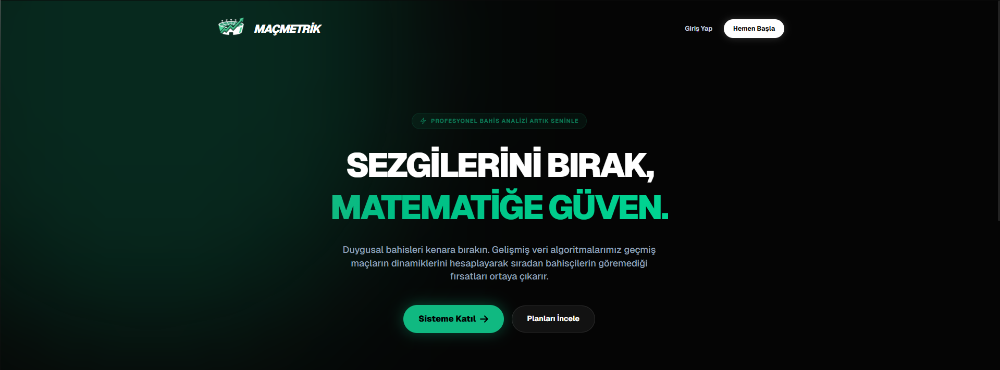
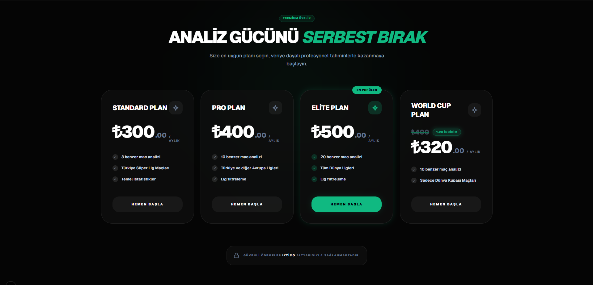
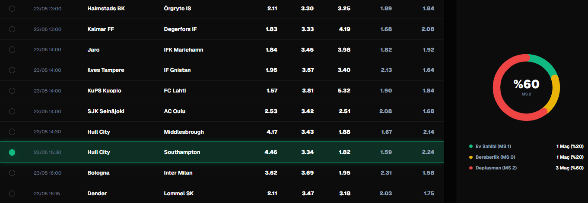
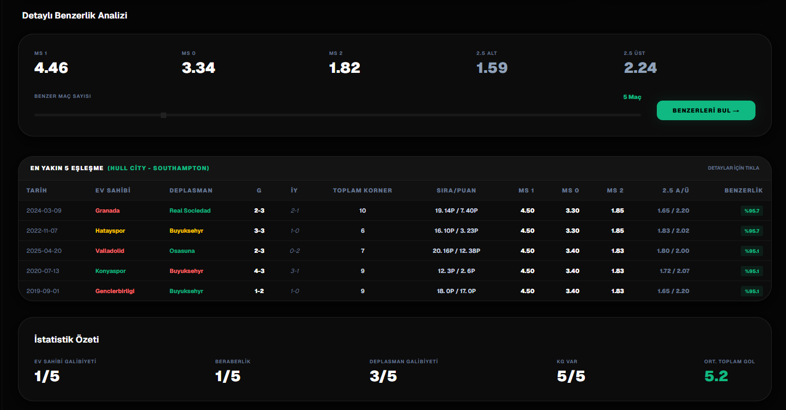

  <!-- LOGO VEYA BANNER BURAYA EKLENECEK -->
  

   
   
  
  # 🚀 MacMetrik.net - Yeni Nesil Spor Analiz Platformu
  
  **Kazanmaya Giden Yolda En Büyük Yardımcınız!**

  

---

## 🌟 Neden MacMetrik?

MacMetrik.net, futbol ve diğer spor müsabakaları için geliştirilmiş, detaylı istatistik ve gelişmiş yapay zeka destekli analizler sunan bir platformdur. Doğru tahminler yapmak ve riskleri en aza indirmek için ihtiyacınız olan tüm veriler burada.

 

<!-- EKRAN GÖRÜNTÜSÜ VEYA ÖZELLİK GÖRSELİ BURAYA EKLENECEK -->

  

 

### 🔥 Öne Çıkan Özelliklerimiz

- 📊 **Detaylı İstatistikler:** Geçmiş maç analizleri, takım form durumları, sakat ve cezalı oyuncu bilgileri.
- 🤖 **Yapay Zeka Destekli Tahminler:** Gelişmiş algoritmalar ile hesaplanmış maç tahminleri.
- ⚡ **Canlı Analizler:** Maç sırasında anlık değişen oranlara ve aksiyona göre güncellenen veriler.
- 📱 **Mobil Uyumlu Kullanım:** İster bilgisayarda, ister telefonda her an yanınızda.

---

## 🎯 Ne Tür Veriler Sunuyoruz?

  <!-- HİZMETLERİ ANLATAN YAN YANA GÖRSELLER -->
  
  

 

| Özellik | Açıklama |
|---|---|
| **Gol Analizleri** | Alt/Üst ve Karşılıklı Gol olasılıklarını geçmiş verilere göre detaylı analiz eder. |
| **Korner/Kart İstatistikleri** | Maçlardaki agresiflik ve korner potansiyelini takım dinamiklerine göre ölçer. |
| **Sürpriz Tahminler** | Yüksek oranlı, potansiyel barındıran ancak gözden kaçan detayları sizin için bulur. |

---

## 🚀 Hemen Başlayın!

Kazanmaya başlamak için daha fazla beklemeyin. MacMetrik.net'i ziyaret edin ve maçların arka planındaki gerçek verilerle analiz stratejinizi güçlendirin!

 

  
  ### 👉 [www.macmetrik.net](https://macmetrik.net) 👈
  
   
  
  <!-- UYGULAMA İNDİRME BUTONLARI VEYA YÖNLENDİRME GÖRSELİ (Opsiyonel) -->
  
  

---
*Not: Bu depo, **[MacMetrik.net](https://macmetrik.net)** platformunun tanıtımı amacıyla oluşturulmuştur.*
